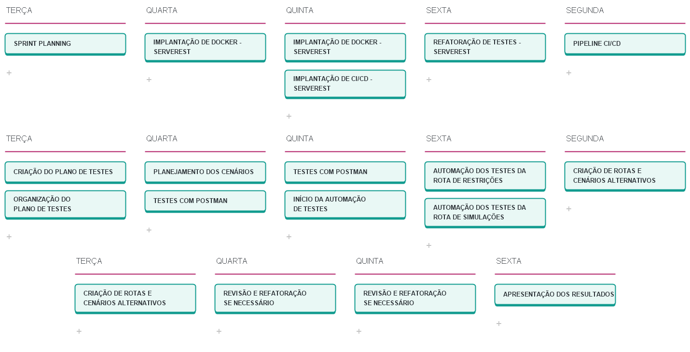

<h1 align="center">PLANO DE TESTE</h1>

## 1.	NOME DO PROJETO
<p align="justify">Usabilidade da [API] Sicredi para visualização de dados de potenciais clientes e realizar operações CRUD dos mesmos.</p>

## 2.	RESUMO
<p align="justify">O usuário pretende fazer o uso da API para verificar os potenciais clientes da empresa e caso eles não tenham nenhuma restrição com relação ao seu CPF poderão ter os dados colhidos e cadastrados para uma linha de crédito e administrados a partir disso, com a possibilidade de ter os dados atualizados, procurados ou excluídos também. Visto isso, serão verificados todos os endpoints presentes na documentação Swagger fornecida pela Sicredi realizando testes de funcionalidade e automatizando os mesmos para maior agilidade no processamento dos testes.</p>

## 3.	PESSOAS ENVOLVIDAS
Testador que realizar as verificações e os testes:
**Pedro Raimundo de Carvalho Junior**

## 4.	FUNCIONALIDADES OU MÓDULOS A SEREM TESTADOS

#### Métodos do módulo de verificação de restrições da API da Sicredi:

- Método `GET` – Ao informar o CPF de um cliente em potencial, verifica se seu CPF possui alguma restrição antes de realizar um cadastro para linha de crédito;

<p align="justify">Será testado o endpoint especificado na documentação Swagger do método acima citado, verificando sua funcionalidade de acordo com a história de usuário.</p>

#### Métodos do módulo de gerenciamento de clientes da API da Sicredi:

- Método `GET` – Listar todos os clientes cadastrados e buscar um usuário específico informando seu CPF;
- Método `POST` – Cadastrar um novo cliente;
- Método `PUT` – Editar um cliente previamente cadastrado na lista;
- Método `DELETE` – Excluir um cliente cadastrado informando o ID pessoal do mesmo.

<p align="justify">Serão testados os endpoits especificados na documentação Swagger de cada método apresentado acima, serão verificadas as funcionalidades com base na história de usuário.</p>


## 5. MAPA MENTAL DA API E SEUS ENDPOINTS


## 6.	LOCAL DOS TESTES
<p align="justify">Em um computador com os componentes necessários instalados, sem necessidade de ambiente próprio, horário de testes entre as 13:30H e 17:30H.</p>

## 7.	RECURSOS NECESSÁRIOS

<p align="justify">Todos os recursos serão providenciados pelo testador a qual este plano foi designado.</p>

- Instalação da ferramenta Postman para testes de API;
- Instalação da ferramenta Eclipse e dependencias Junit e RestAssured;
- Instalação de JDK 11 ou superior;
- Maven deve estar instalado e configurado no path da aplicação;
- Instalação local da API Sicredi.

## 8.	CRITÉRIOS USADOS

**Que teste será feito:**
<p align="justify">Serão feitos testes de funcionalidade da API da Sicredi, serão testadas as seguintes funções da API:</p>

- Função de verificação de restrições no CPF de potenciais clientes;
- Funções de CRUD de simulações de empréstimo na financeira.

**Como será feito:**
1. Escolher um dos métodos da API Sicredi podendo ser de Restrições ou Simulações (Por exemplo: O método GET de restrições ou de simulações);
2. Realizar os testes que se virem necessários para verificar se a função especificada no Swagger funciona da maneira descrita e é útil para o cliente de acordo com a história de usuário;
3. Verificar outros caminhos de teste do mesmo método não especificadas pelo cliente mas que é visto como útil para uma entrega de qualidade do produto final;
4. Repetir os passos acima descritos com cada método apresentado na seção “Funcionalidades ou módulos a serem testados”.

## 9.	RISCOS

**Falha da internet** – Pode ser contornado instalando o software de teste (Postman) e a API Sicredi localmente no computador em que os testes serão realizados.

**Falha de energia elétrica** – Caso ocorra uma falha de energia elétrica durante o ocorrido será necessário reiniciar os testes em outro horário ou mudar os testes para um local com maior estabilidade, caso nenhum dos dois seja possível, será necessário garantir que um gerador de emergência esteja disponível para que os testes não sejam interrompidos durante a execução.

## 10.	COMO OS RESULTADOS SERÃO DIVULGADOS
<p align="justify">Os resultados dos testes serão documentados no plano de testes, na matriz de casos de teste, no relatório de bugs, nos artefatos do pipeline CI/CD e no relatório Allure publicado pelo GitHub Pages.</p>

## 11.	CRONOGRAMA



## 12. CENÁRIOS DE TESTE

### VERIFICAÇÃO DE RESTRIÇÕES PELO CPF

- <p align="justify">Teste verificando se a função de consulta de restrição do CPF funciona corretamente como exposta no swagger da API, para realização dos testes foram providenciados as seguintes informações:</p>

| CPFs com Restrição |
| ------------------ |
|    97093236014    |
|    60094146012    |
|    84809766080    |
|    62648716050    |
|    26276298085    |
|    01317496094    |
|    55856777050    |
|    19626829001    |
|    24094592008    |
|    58063164083    |

<p align="justify">Todos os números de CPF citados na tabela acima possuem restrições relacionadas a eles, a API não informa quais restrições ele possui, apenas informa se o número enviado possui ou não restrição. A partir disso todos os números acima deverão ser verificados através de um teste para validar se a primeira função está funcionando corretamente.</p>

**Passo a passo para realização do teste:**
1. Escolher um dos números da tabela acima (por exemplo: 97093236014);
2. Realizar uma operação `GET` no endpoint de restrições da API da Sicredi informando o CPF escolhido (independente da porta a qual está sendo executada o endpoint será: `<host>/api/v1/restricoes/{cpf}`);
3. Obter e analisar a resposta obtida através da requisição.

**Resultado esperado:**
O resultado esperado da requisição é um Status code **200** e um corpo de resposta informando que o CPF escolhido possui restrições ligadas a ele.

```json
{
   "mensagem": "O CPF 97093236014 possui restrição"
 }
```
---
- <p align="justify">Teste verificando se um status code de 204 é recebido ao informar um CPF que não faz parte da lista de CPFs com restrições.</p>

**Passo a passo para realização do teste:**
1. Escolher um número que não pertence a tabela de CPFs com restrições (por exemplo: 12345678912);
2. Realizar uma operação `GET` no endpoint de restrições da API da Sicredi informando o CPF escolhido (independente da porta a qual está sendo executada o endpoint será: `<host>/api/v1/restricoes/{cpf}`);
3. Obter e analisar a resposta obtida através da requisição.

**Resultado esperado:**
O resultado esperado da requisição é um Status code **204** sem mais nenhuma informação ou corpo de resposta.

---

### OPERAÇÕES CRUD DE SIMULAÇÕES

### Cadastrar simulações no sistema:

- <p align="justify">Teste verificando se um cadastro bem sucedido é obtido ao enviar informações corretamente inseridas através do body.</p>

**Passo a passo para realização do teste:**
1. Selecionar as informações que serão enviadas através da requisição e montar um request body no seguinte formato de exemplo:

```json
{
  "nome": "Fulano de Tal",
  "cpf": 97093236014,
  "email": "email@email.com",
  "valor": 1200,
  "parcelas": 3,
  "seguro": true
}
```

2. Realizar uma operação `POST` no endpoint de simulações da API da Sicredi enviando o body como especificado acima (independente da porta a qual está sendo executada o endpoint será: `<host>/api/v1/simulacoes`);
3. Obter e analisar a resposta obtida através da requisição.

**Resultado esperado:**
O resultado esperado da requisição é um Status code **201** com o corpo de resposta contendo as informações que acabaram de ser enviadas:

```json
{
  "nome": "Fulano de Tal",
  "cpf": 97093236014,
  "email": "email@email.com",
  "valor": 1200,
  "parcelas": 3,
  "seguro": true
}
```
---
- <p align="justify">Teste verificando se ao não preencher todas as informações que serão enviadas no body, um cadastro é mal sucedido.</p>

**Passo a passo para realização do teste:**
1. Selecionar as informações que serão enviadas através da requisição e montar um request body no seguinte formato de exemplo:

```json
{
  "nome": "Fulano de Tal",
  "cpf": 97093236014,
  "email": "email@email.com",
  "valor": 1200,
  "parcelas": 3,
  "seguro": true
}
```
2. As informações enviadas o body dessa requisição não necessitam estar completas ou nos formatos corretos, a validação será feita a partir do envio incorreto de informações, fica a critério do testador como elas serão validadas;
3. Realizar uma operação `POST` no endpoint de simulações da API da Sicredi enviando o body como especificado acima (independente da porta a qual está sendo executada o endpoint será: `<host>/api/v1/simulacoes`);
4. Obter e analisar a resposta obtida através da requisição.

**Resultado esperado:**
O resultado esperado da requisição é um Status code **400** com o corpo de resposta contendo as informações erradas ou faltando que foram enviadas no request body:

```json
{
  "erros": {
    "additionalProp1": "string",
    "additionalProp2": "string",
    "additionalProp3": "string"
  }
}
```
---
- <p align="justify">Teste verificando se ao preencher o campo de CPF com um número préviamente cadastrado ele vai negar um novo cadastro.</p>

**Passo a passo para realização do teste:**
1. Selecionar as informações que serão enviadas através da requisição e montar um request body no seguinte formato de exemplo:

```json
{
  "nome": "Fulano de Tal",
  "cpf": 97093236014,
  "email": "email@email.com",
  "valor": 1200,
  "parcelas": 3,
  "seguro": true
}
```
2. A informação do CPF nessa requisição necessita ser o mesmo que uma das cadastradas anteriormente, no caso basta realizar uma requisição `POST` no endpoint de simulações da API da Sicredi enviando o body como especificado acima e em seguida realizar outra sem alterar as informações enviadas (independente da porta a qual está sendo executada o endpoint será: `<host>/api/v1/simulacoes`);
3. Obter e analisar a resposta obtida através da requisição.

**Resultado esperado:**
O resultado esperado da requisição é um Status code **409** sem mais nenhuma informação ou corpo de resposta.

---

### Procurar por simulações cadastradas no sistema:

- <p align="justify">Teste verificando se é possível visualizar todas as simulações que existem cadastradas no sistema.</p>

**Passo a passo para realização do teste:**
1. Realizar uma operação `GET` no endpoint de simulações da API da Sicredi (independente da porta a qual está sendo executada o endpoint será: `<host>/api/v1/simulacoes`);
2. Obter e analisar a resposta obtida através da requisição.

**Resultado esperado:**
O resultado esperado da requisição é um Status code **200** com um corpo de resposta contendo todos as simulações cadastradas no sistema no seguinte formato:

```json
[
  {
    "nome": "Fulano de Tal",
    "cpf": 97093236014,
    "email": "email@email.com",
    "valor": 1200,
    "parcelas": 3,
    "seguro": true
  }
]
```
---
- <p align="justify">Teste verificando se é possível visualizar alguma simulação no sistema se todas forem deletadas.</p>

**Passo a passo para realização do teste:**
1. Garantir que todos os registros anteriores de simulação tenham sido excluídos realizando uma operação `DELETE` no endpoint de simulações da API da Sicredi informando o ID de simulação a ser excluído (independente da porta a qual está sendo executada o endpoint será: `<host>/api/v1/simulacoes/{id}`);
1. Realizar uma operação `GET` no endpoint de simulações da API da Sicredi informando (independente da porta a qual está sendo executada o endpoint será: `<host>/api/v1/simulacoes`);
2. Obter e analisar a resposta obtida através da requisição.

**Resultado esperado:**
O resultado esperado da requisição é um Status code **204** sem mais nenhuma informação ou corpo de resposta.

---

- <p align="justify">Teste verificando se é possível visualizar uma simulação específica informando o CPF cadastrado no sistema.</p>

**Passo a passo para realização do teste:**
1. Escolher um dos números de CPF previamente cadastrados e visualizados através do `GET` de todos os registros;
2. Realizar uma operação `GET` no endpoint de simulações da API da Sicredi informando o CPF escolhido (independente da porta a qual está sendo executada o endpoint será: `<host>/api/v1/simulacoes/{cpf}`);
3. Obter e analisar a resposta obtida através da requisição.

**Resultado esperado:**
O resultado esperado da requisição é um Status code **200** com um corpo de resposta contendo a simulação cadastrada no sistema no seguinte formato:

```json
{
  "nome": "Fulano de Tal",
  "cpf": 97093236014,
  "email": "email@email.com",
  "valor": 1200,
  "parcelas": 3,
  "seguro": true
}
```
---

- <p align="justify">Teste verificando se a função de consulta de simulações mostra quando um CPF possui restrição ligada a ele para realização dos testes foram providenciados as seguintes informações:</p>

| CPFs com Restrição |
| ------------------ |
|    97093236014    |
|    60094146012    |
|    84809766080    |
|    62648716050    |
|    26276298085    |
|    01317496094    |
|    55856777050    |
|    19626829001    |
|    24094592008    |
|    58063164083    |

<p align="justify">Todos os números de CPF citados na tabela acima possuem restrições relacionadas a eles, a API não informa quais restrições ele possui, apenas informa se o número enviado possui ou não restrição. A partir disso todos os números acima deverão ser verificados através de um teste para validar se a função está funcionando corretamente.</p>

**Passo a passo para realização do teste:**
1. Escolher um dos números da tabela acima (por exemplo: 97093236014);
2. Realizar uma operação `GET` no endpoint de simulações da API da Sicredi informando o CPF escolhido (independente da porta a qual está sendo executada o endpoint será: `<host>/api/v1/simulacoes/{cpf}`);
3. Obter e analisar a resposta obtida através da requisição.

**Resultado esperado:**
O resultado esperado da requisição é um Status code **404** e um corpo de resposta informando que o CPF escolhido possui restrições ligadas a ele:

```json
{
  "mensagem": "O CPF 999999999 possui restrição"
}
```
- <p align="justify">Teste verificando se é possível visualizar uma simulação específica informando um CPF inexistente na base de dados.</p>

**Passo a passo para realização do teste:**
1. Escolher um número de CPF que não foi previamente cadastrado através do `GET` de todos os registros;
2. Realizar uma operação `GET` no endpoint de simulações da API da Sicredi informando o CPF escolhido (independente da porta a qual está sendo executada o endpoint será: `<host>/api/v1/simulacoes/{cpf}`);
3. Obter e analisar a resposta obtida através da requisição.

**Resultado esperado:**
O resultado esperado da requisição é um Status code **404** sem mais nenhuma informação ou corpo de resposta.

### Editar simulações cadastradas no sistema:

- <p align="justify">Teste verificando se é possível atualizar o cadastro de uma simulação com sucesso ao enviar informações corretamente preenchidas em um request body;</p>

**Passo a passo para realização do teste:**
1. Selecionar as informações que serão enviadas através da requisição e montar um request body no seguinte formato de exemplo:

```json
{
  "nome": "Fulano de Tal",
  "cpf": 97093236014,
  "email": "email@email.com",
  "valor": 1200,
  "parcelas": 3,
  "seguro": true
}
```
2. Selecionar um CPF previamente cadastrado para ser enviado durante a operação alterando uma das informações que foram cadastradas no request;
3. Realizar uma operação `PUT` no endpoint de simulações da API da Sicredi enviando o body como especificado acima e informando o CPF da simulação a ser alterada ao final do endpoint (independente da porta a qual está sendo executada o endpoint será: `<host>/api/v1/simulacoes/{cpf}`);
4. Obter e analisar a resposta obtida através da requisição.

**Resultado esperado:**
O resultado esperado da requisição é um Status code **200** com o corpo de resposta contendo as informações que acabaram de ser enviadas e alteradas:

```json
{
  "nome": "Fulano de Tal",
  "cpf": 97093236014,
  "email": "email@email.com",
  "valor": 1200,
  "parcelas": 3,
  "seguro": true
}
```
---

- <p align="justify">Teste verificando se é possível atualizar o cadastro de alguma simulação ao não informar corretamente o CPF no endpoint da requisição.</p>

**Passo a passo para realização do teste:**
1. Selecionar as informações que serão enviadas através da requisição e montar um request body no seguinte formato de exemplo:

```json
{
  "nome": "Fulano de Tal",
  "cpf": 97093236014,
  "email": "email@email.com",
  "valor": 1200,
  "parcelas": 3,
  "seguro": true
}
```
2. Selecionar um CPF que não tenha sido previamente cadastrado para ser enviado durante a operação;
3. Realizar uma operação `PUT` no endpoint de simulações da API da Sicredi enviando o body como especificado acima e informando o CPF da simulação a ser alterada ao final do endpoint (independente da porta a qual está sendo executada o endpoint será: `<host>/api/v1/simulacoes/{cpf}`);
4. Obter e analisar a resposta obtida através da requisição.

**Resultado esperado:**
O resultado esperado da requisição é um Status code **404** com o corpo de resposta informando que o CPF informado não encontrado na base de dados da API:

```json
{
  "mensagem": "O CPF 999999999 não encontrado"
}
```
---

- <p align="justify">Teste verificando se é possível atualizar o cadastro de alguma simulação ao informar o CPF de uma outra simulação no endpoint da requisição.</p>

**Passo a passo para realização do teste:**
1. Selecionar as informações que serão enviadas através da requisição e montar um request body no seguinte formato de exemplo substituindo o CPF por um CPF já cadastrado:

```json
{
  "nome": "Fulano de Tal",
  "cpf": 97093236014,
  "email": "email@email.com",
  "valor": 1200,
  "parcelas": 3,
  "seguro": true
}
```
2. Realizar uma operação `PUT` no endpoint de simulações da API da Sicredi enviando o body como especificado acima e informando o CPF da simulação a ser alterada ao final do endpoint (independente da porta a qual está sendo executada o endpoint será: `<host>/api/v1/simulacoes/{cpf}`);
3. Obter e analisar a resposta obtida através da requisição.

**Resultado esperado:**
O resultado esperado da requisição é um Status code **409** com o corpo de resposta informando que o CPF informado já existe na base de dados:

```json
{
  "mensagem": "CPF já existente"
}
```
---

### Excluir uma simulação cadastrada no sistema:

- <p align="justify">Teste verificando se é possível excluir uma simulação previamente cadastrada no sistema.</p>

**Passo a passo para realização do teste:**
1. Selecionar um ID previamente cadastrado para ser enviado durante a operação ao realizar uma operação `GET` e utilizando um dos IDs de simulações existentes na base de dados;
2. Realizar uma operação `DELETE` no endpoint de simulações da API da Sicredi informando o ID da simulação cadastrada (independente da porta a qual está sendo executada o endpoint será: `<host>/api/v1/simulacoes/{id}`);
3. Obter e analisar a resposta obtida através da requisição.

**Resultado esperado:**
O resultado esperado da requisição é um Status code **200** com um corpo de resposta contendo uma mensagem informando que a requisição foi feita com sucesso:

```json
"string"
```
---

- <p align="justify">Teste verificando se é possível excluir uma simulação previamente cadastrada no sistema sem informar corretamente o ID de usuário.</p>

**Passo a passo para realização do teste:**
1. Selecionar um ID que não esteja previamente cadastrado para ser enviado durante a operação ao realizar uma operação `GET` e utilizando um numero diferente dos IDs de simulações existentes na base de dados;
2. Realizar uma operação `DELETE` no endpoint de simulações da API da Sicredi informando um ID não existente nas simulações cadastradas (independente da porta a qual está sendo executada o endpoint será: `<host>/api/v1/simulacoes/{id}`);
3. Obter e analisar a resposta obtida através da requisição.

**Resultado esperado:**
O resultado esperado da requisição é um Status code **404** com um corpo de resposta contendo uma mensagem informando que a simulação não foi encontrada:

```json
{
  "mensagem": "Simulação não encontrada"
}
```

### PRIORIZAÇÃO E AUTOMAÇÃO DE TESTES
<p align="justify">Dos cenários base citados acima, os testes que possuem maior relevância são inicialmente os de cadastro do endpoint de simulações, pois sem esta funcionalidade nenhuma das outras funções segue a funcionar, exceto a de restrições que não possui nenhuma ligação direta com as simulações. Visto isso, a prioridade seria automatizar os testes de cadastro para reduzir tempo de execução, melhorar a precisão das validações e ampliar a cobertura da suíte.</p>

Os cenários automatizados ficam disponíveis no repositório, junto com a suíte RestAssured, os schemas de contrato e as instruções de execução.
